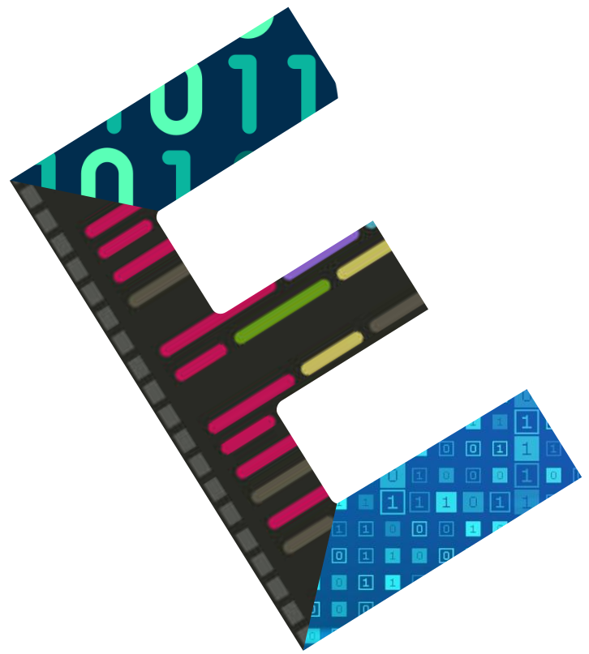

<span style="font-size:30px;"> Eruca | Dynamic Portfolio<span/>
<br/>


## Eruca
### Dynamic portfolio created by Laravel 8 & Vue 2.6


## Technologies Used
> Front End
- HTML
- SCSS
- JavaScript
- Bootstrap
- Vue
- Apollo
- Webpack
> Back End
- PHP
- MySQL
- GraphQL
- Laravel 

## Packages Used
- Passport
- Laravel-graphql-playground
- Lighthouse
- Vue Apollo
- Vue router
- Axios
- FontAwesome
- Html2Canvas

<hr/>

## Installation

#### Vue Configuration

```sh
    cd eruca
```

```sh
    npm install
```


```sh
    npm run watch
```
#### Laravel Configuration


```sh
    composer install
```

```sh
    php artisan key:generate
```

```sh
    php artisan migrate
```

```sh
    php artisan serve
```
#### Testing

> open: http://127.0.0.1:8000/